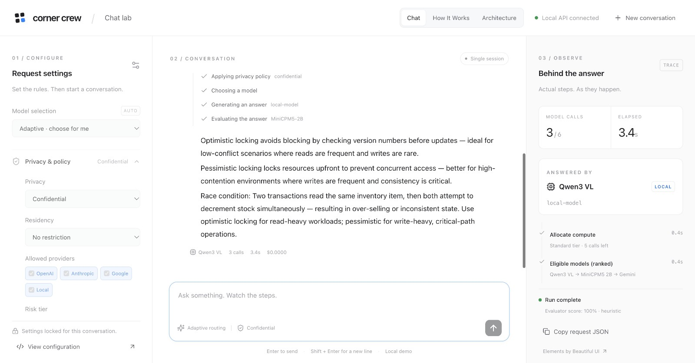

# Corner Crew

**One control plane for AI. Local when possible, cloud when needed.**

A hackathon demo by Sid, Piranavan, and Frank that turns a chat request into a configurable
execution pipeline. A React chat UI sits on FastAPI/Pydantic, with llama.cpp for
local MiniCPM and Qwen inference and adapters for Gemini, OpenAI, and Anthropic.

## The demo

Configure the rules, send a message, and watch the real execution trace:

**Classify → Apply policy & context → Allocate compute → Select a model → Execute
→ Evaluate → Return, verify, or escalate.**

- **Chat:** one conversation with upfront policy, budget, compute, verification,
  consensus, memory, routing, and response controls.
- **How It Works:** a clickable, illustrative walkthrough of a request.
- **Architecture:** deployment diagram and the rationale for a control plane.

Start at [localhost:3000](http://localhost:3000). MiniCPM handles classification
and evaluation; local or configured cloud models generate answers. Gemini has
been tested end-to-end in this local setup. Other cloud providers require keys,
model IDs, and deployment metadata.

## Watch the demo

[](docs/demo/corner-crew-three-models.mp4)

**[Watch or download the 29-second video](docs/demo/corner-crew-three-models.mp4).**
Three requests, automatic model selection: a polite rewrite handled by local
MiniCPM, an inventory-locking comparison handled by local Qwen, and a distributed
payment-system design routed to Gemini. The selected model and execution trace
remain visible in the UI. The recording uses a six-call budget, a 20-second latency
target, and a 25-second wall-time limit per request.

## Main differentiators

- **Policy-aware routing:** provider allowlists, privacy rules, and configured
  residency constraints govern where a request may go.
- **Adaptive compute:** start with an inexpensive tier and escalate when needed,
  within cost, time, token, and model-call limits.
- **Conditional checks:** evaluation can trigger verification or independent
  model consensus; unmet checks surface uncertainty instead of implying success.
- **Local + cloud flexibility:** one payload works across local llama.cpp models
  and supported cloud providers, with optional application-owned memory.
- **Visible decisions:** streamed lifecycle events show model choices, budget
  constraints, checks, and outcomes alongside the answer.

## Deployment direction

The proposed hybrid architecture extends the local service to Google Cloud:
HTTPS ingress, autoscaled GKE pods, shared memory and storage, logs and tracing,
and an optimization loop informed by recorded traffic. Rate-limit overflow would
move eligible work from local capacity to cloud capacity.

These cloud infrastructure components, Tailscale integration, automatic 429
spillover, and Alpha Evolve optimization are **design proposals**, not deployed
features. The current demo uses local FastAPI, llama.cpp, optional SQLite memory,
and direct cloud-model API calls. The supplied diagram labels the local runtime
“Ollama” and the endpoint `/chat/v1`; this implementation uses **llama.cpp** and
**`/chat` / `/chat/stream`**.

## Run

Requires Python 3.11+ and [uv](https://docs.astral.sh/uv/).
Run these commands from the repository directory (the inner `corner-crew` folder):

```sh
uv sync
cp .env.example .env
uv run uvicorn app.main:app --reload --host 127.0.0.1 --port 8000
```

Open http://127.0.0.1:8000/docs for interactive API documentation.
The server starts without cloud credentials. Edit `.env` with the API keys and
model IDs you have access to, then restart the server. Keep keys in `.env`, which
is ignored by Git. Each teammate uses their own `.env`.

## Local models

### One-command startup on Sid's machine

```sh
./scripts/start-local.sh
./scripts/stop-local.sh
```

These machine-specific scripts run Qwen, MiniCPM, FastAPI, and the chat UI in the
`corner-crew-local` tmux session. Start is safe to repeat. Stop shuts down only
the project's web, API, and model windows, preserving model files and the control shell.
Attach with `tmux attach -t corner-crew-local`; use Ctrl-b then n to switch
windows and Ctrl-b then d to detach. In the prepared control window, Up recalls
start; a second Up recalls stop. API docs: http://127.0.0.1:8000/docs.

### Manual startup

Use your installed `llama-server` with a chat-capable GGUF model:

```sh
llama-server -m /absolute/path/to/model.gguf \
  --alias local-model --host 127.0.0.1 --port 8080
```

On Sid's machine, an existing model is available:

```sh
llama-server \
  -m /Users/sid/models/qwen3-vl-8b-instruct/Qwen3VL-8B-Instruct-Q4_K_M.gguf \
  --alias local-model --host 127.0.0.1 --port 8080
```

Keep this running in a separate terminal from FastAPI. The default `.env`
connects to `http://127.0.0.1:8080/v1/`. `LOCAL_API_KEY=local` is an SDK
placeholder; if you enable server authentication, set the matching key.
For new models, download a chat/instruct GGUF supported by your llama.cpp build
and supply its path with `-m`. No model download is needed for Sid's example.

```sh
curl http://127.0.0.1:8000/chat \
  -H 'Content-Type: application/json' \
  -d '{"provider":"local","messages":[{"role":"user","content":"Say hello to Sid and Piranavan."}]}'
```

To use another downloaded model, restart `llama-server` with its GGUF path.
Keep `LOCAL_MODEL` matched to the server's `--alias`.
For another OpenAI-compatible local server, change `LOCAL_BASE_URL` and
`LOCAL_API_KEY` as needed. The example uses local inference after downloading.

## MiniCPM5 2B

The model found in Chrome is loaded by [OpenJev](https://openjev.com/) and stored
in that site's browser cache. The backend uses a separate official
[Q4_K_M GGUF](https://huggingface.co/openbmb/MiniCPM5-2B-GGUF) copy at
`/Users/sid/models/minicpm5-2b/MiniCPM5-2B-Q4_K_M.gguf` (1.56 GB).
`scripts/start-local.sh` starts it in the `minicpm` tmux window on port 8081
using that file. MiniCPM is required for classification, including requests targeting
other models. Qwen continues on port 8080. Stop shuts down both models.

```sh
curl http://127.0.0.1:8000/chat \
  -H 'Content-Type: application/json' \
  -d '{"provider":"minicpm","messages":[{"role":"user","content":"Say hello."}]}'
```

For another machine, download that GGUF and run:

```sh
curl -fL -o MiniCPM5-2B-Q4_K_M.gguf \
  https://huggingface.co/openbmb/MiniCPM5-2B-GGUF/resolve/main/MiniCPM5-2B-Q4_K_M.gguf
llama-server -m /path/to/MiniCPM5-2B-Q4_K_M.gguf \
  --alias MiniCPM5-2B --host 127.0.0.1 --port 8081 -c 4096 --jinja
```

The `MINICPM_BASE_URL`, `MINICPM_API_KEY`, and `MINICPM_MODEL` settings can be
overridden in `.env`. This integration offers text chat; the browser demo's
direct option-probability readout is a separate feature.

## Cloud models

Set `OPENAI_API_KEY` and `OPENAI_MODEL`, or `GEMINI_API_KEY` and `GEMINI_MODEL`,
in `.env`. Anthropic uses `ANTHROPIC_API_KEY` and `ANTHROPIC_MODEL`.
Explicit `model` requests must match a registered deployment. Cloud models also
need pricing in `MODEL_METADATA`; see the policy and budget notes below.

```sh
curl http://127.0.0.1:8000/chat \
  -H 'Content-Type: application/json' \
  -d '{"provider":"gemini","messages":[{"role":"user","content":"Suggest a hackathon project."}]}'
```

`google` aliases `gemini`. An explicit `provider` or registered `model` pins
execution candidates, including fallbacks and consensus. MiniCPM remains the
local controller. Omit `provider` and use `model: "@auto"` for adaptive routing.

## Adaptive request pipeline

`POST /chat` accepts the complete envelope in
[`examples/adaptive-chat.json`](examples/adaptive-chat.json). Controls are
validated (unknown fields and unsupported option values return 422), applied by
the server, and never forwarded wholesale to a vendor as model parameters.

```sh
curl http://127.0.0.1:8000/chat \
  -H 'Content-Type: application/json' \
  -d '{"model":"@auto","messages":[{"role":"user","content":"Say hello."}]}'
```

Flow: load optional memory → MiniCPM classification → enforce privacy/residency →
allocate compute → select model → execute → MiniCPM evaluation → return, verify,
or escalate → conditional consensus → optional memory write → response.

The response retains `provider`, `model`, `content`, `finish_reason` and adds
`status`, `confidence`, `uncertainty`, `classification`, `usage`, `citations`, and
an ordered `trace`. `status: "ok"` means the configured checks completed without
a material limitation; it is not a guarantee that the answer is correct.

### Policy and model catalog

- `GET /models` shows registered deployments, tiers, family/vendor, operator-declared
  residency, confidentiality approval, prices, and quality/latency estimates.
- MiniCPM classification must run at a loopback URL. Its residency is checked
  **before** memory access/classification. Classification failure stops execution.
  The local classifier is internal control processing; the provider allowlist
  gates answer generation and subsequent evaluation/verification calls.
- Effective privacy is the strictest of requested, classified, and stored-memory
  privacy. A classifier cannot lower the caller's privacy requirement.
- Confidential data can use a cloud only when both the request allowlist and
  server metadata permit it (`confidential_approved: true`). Restricted data
  is local-only. Classification is an LLM heuristic, not a certified DLP system.
- A residency constraint excludes unknown/mismatched regions. Set
  `LOCAL_DATA_RESIDENCY=US` **only if accurate for this deployment**. The full
  example requires this setting. Cloud regions must describe the actual configured
  service; these declarations do not provision regional endpoints or prove compliance.
- `MODEL_METADATA` is an operator-owned JSON map (example in `.env.example`).
  Metadata must name the configured model exactly, so a request cannot substitute
  an unpriced/unapproved model. Change defaults when replacing local model families.
- MiniCPM is cheap, Qwen standard, and configured cloud models default to frontier.
  These are configurable prototype tiers. Routing first targets the allocated tier,
  then balances the selected quality/cost/latency estimates with equal weights.
  It is not a learned router or a real-time performance forecast.

### Budgets, escalation, and verification

- Every model invocation counts, including classifier, evaluator, failed attempts,
  verifier, escalations, and consensus votes. SDK retries are disabled.
- Cost admission reserves estimated input plus the maximum completion cost using
  operator-supplied prices. Missing cloud prices prevent calls. Usage reconciles
  reservations; failed/missing-usage calls retain them. Local inference has zero
  API cost (hardware/power costs excluded). This is an estimated spend guard, not
  an invoice guarantee. Upstream calls already dispatched may bill after timeout.
- Wall time cancels outstanding async model work. `max_latency_ms` is a soft target:
  optional work stops after it; an initial answer may take longer. Hard limits
  never expand under `best_effort`; it returns an existing answer with uncertainty,
  or an error if no answer exists. `reject` returns an error.
- `max_reasoning_tokens` conservatively caps **all completion tokens**, including
  controller output, because providers do not expose consistent hidden-reasoning
  accounting. Effort chooses a 512/1024/2048 per-answer output allowance; controller
  calls cap at 384. Local thinking is disabled for controllers/low effort and
  enabled for medium/high effort. This does not claim identical reasoning-effort
  semantics across cloud vendors.
- Low confidence or failed checks may choose a stronger eligible tier. A new answer
  gets a new evaluation; exhausted budgets never inherit the old confidence.
- Independent review uses a different model family. JSON validation uses
  `response.format: "json"` with optional `response.json_schema` (no schema refs).
  Tool checking currently parses fenced Python using `ast`; it checks syntax only.
  No generated code is executed, and no web fact-checking tool is installed.
- Consensus requires distinct families and, when requested, distinct model vendors.
  It takes a strict majority of whitespace/case-normalized exact answers; paraphrases
  conservatively count as disagreement. With only two local families, a three-family
  requirement remains unmet. `diversity.model_families: false` does not waive
  `min_independent_families`. Four calls may not cover a full verification/escalation
  cycle; the trace records the limitation.
- Confidence is the evaluator's uncalibrated score, not a probability of correctness.
  Missing checks, tools, consensus or budgets produce uncertainty or rejection.
  `citations: "auto"` currently returns an empty list and an unavailable trace event;
  model-written links are never presented as verified sources.

### Memory

User memory is opt-in. Set `user_id` when enabling `memory.read` or `memory.write`.
The full example includes a demo identity. SQLite at `MEMORY_PATH` (default
`.data/memory.sqlite3`, ignored by Git) stores successful conversation turns,
partitioned by user, with privacy labels. Reads include the latest three turns,
chronologically, with newer user statements taking precedence in the prompt.
This is recent conversation recall, not semantic fact extraction or conflict resolution.
`write: "auto"` writes only non-degraded, evaluated answers. `retention: "request"`
avoids persistent reads/writes. Memory content is reclassified before routing.
`user_id` is **not authentication**; this local prototype must bind it to an
authenticated identity before multi-user deployment. Data is stored as local
plaintext; no encryption-at-rest layer or automatic retention expiry is provided.

## API

- `GET /health`: process health, not model readiness.
- `GET /providers`: credentials/configuration status, not availability.
- `GET /models`: deployment catalog.
- `POST /chat`: adaptive pipeline with ordered text messages.
- `POST /chat/stream`: NDJSON lifecycle events followed by a result or terminal error.
- `GET /docs`: Swagger UI and all request/response schemas.

This remains a localhost hackathon API without authentication or uploads.

The shared transport uses the OpenAI Python SDK and the documented
[OpenAI Chat Completions](https://developers.openai.com/api/docs/guides/conversation-state),
[Gemini compatibility](https://ai.google.dev/gemini-api/docs/openai),
[Anthropic compatibility](https://platform.claude.com/docs/en/cli-sdks-libraries/libraries/openai-sdk), and
[llama.cpp server](https://github.com/ggml-org/llama.cpp/tree/master/tools/server) interfaces.

## Development

```sh
uv run pytest
uv run ruff check .
uv run ruff format --check .
```

Tests mock upstream HTTP responses; they use no API credits or downloaded models.
`uv.lock` pins dependencies for reproducible setup.

## Chat demo

Open http://localhost:3000. The React/Vite UI uses Beautiful UI foundation styles
and an adapted expandable Thinking State component (MIT; attribution in `web/vendor`).
Configure the eight request-control groups before the first message, then follow
one conversation with real streamed pipeline events and inspectable event details.
Use **New conversation** to unlock settings. **Edit full payload** exposes the JSON.
The run trace is a right-hand panel on desktop and a drawer on smaller screens.
Memory defaults to off; residency defaults to unrestricted so the local demo runs
without asserting unconfigured regional guarantees. Cloud use still requires keys
and server-side policy approvals.

```sh
npm ci --prefix web
./scripts/start-local.sh
# Frontend only (API must already be running on port 8000):
npm run dev --prefix web
# Production build check:
npm run build --prefix web
```

The Vite development server proxies `/api` to FastAPI. It streams lifecycle events;
answer text arrives with the final result. Conversation state lives in the browser
page and resets on reload. The tmux stack includes a `web` window on port 3000.

### Local Gemini demo configuration

The local `.env` registers `gemini-3.8-flash` with operator approval for confidential
requests and standard text rates of $0.75/M input tokens and $3.75/M output tokens
(including thinking). Source checked October 1, 2026:
https://aistudio.google.com/docs/pricing . These rates expire December 31, 2026;
Google lists $1.50/M input and $7.50/M output starting January 1, 2027.
Refresh `MODEL_METADATA` rates before then. These are paid-tier estimates even
if a particular account receives free usage. Approval is a demo routing setting,
not a certification of Google's data handling. Region stays unknown; selecting
US/EU residency still excludes this deployment. The pricing page distinguishes
free-tier product-improvement use from paid-tier handling.

### How It Works infographic

The header links to `/#/how-it-works`, an illustrative architecture walkthrough
adapted from the supplied `code.html`. It keeps the chat mounted while navigating,
so drafts, settings, and conversation state survive switching pages. Sample
metrics and decisions are explicitly labeled as illustrative, not live telemetry.
The isolated HTML in `web/public/infographic/index.html` contains its bundled CSS,
clickable step explanations, keyboard activation, and a replay animation. There
are no model calls or external assets on this page. Styling matches the chat shell.

### Architecture page

`/#/architecture` contains the architecture breakdown moved from How It Works,
the supplied deployment diagram with a full-size link, and a mapping of proposed
infrastructure to the running demo. Navigation keeps the conversation mounted.
